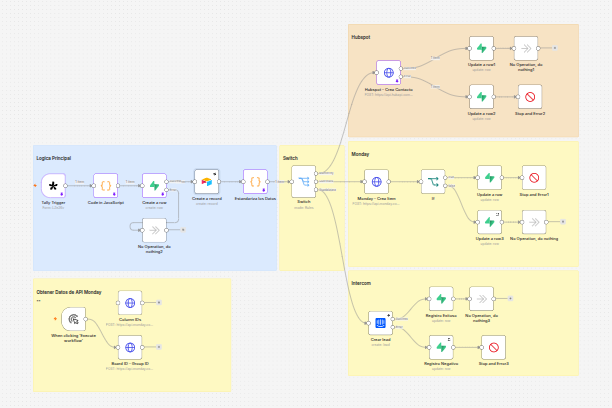
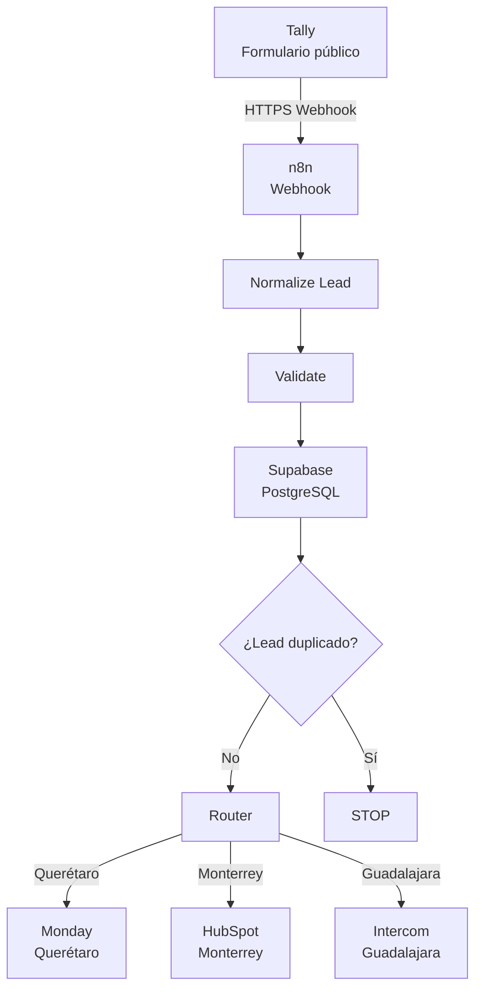
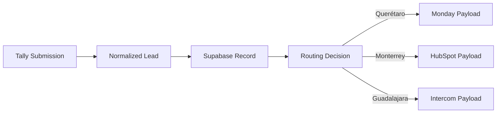

# Plataforma de Integración y Enrutamiento de Leads Multi-CRM

Sistema de integración orientado a capturar leads desde un formulario público, normalizar sus datos, registrar su procesamiento y enrutar automáticamente cada lead hacia el CRM correspondiente según su ubicación.

La solución utiliza **n8n como capa de integración y orquestación**, **Supabase/PostgreSQL como capa de persistencia e idempotencia**, y conecta tres sistemas CRM diferentes:

- Querétaro → Monday
- Monterrey → HubSpot
- Guadalajara → Intercom

El objetivo no es reemplazar los CRMs existentes, sino construir una **capa de integración desacoplada** que permita conectar el sistema de captura con diferentes plataformas y mantener una lógica centralizada de procesamiento.

- Landing Page principal: https://dentalsania.lovable.app
- Database Airtable: https://airtable.com/app3cnq47kQbO42Bx/shrIp7rcxmxi6Oog5
- Hubspot: https://app.hubspot.com/contacts/52031553/objects/0-1/views/72492061/list
- Monday: https://view.monday.com/18430363886-1152c8e35a415f57dc642206177c9b51?r=use1&is_sharable_link=true
---



## Tabla de contenidos

- [1. Contexto](#1-contexto)
- [2. Problema](#2-problema)
- [3. Objetivo](#3-objetivo)
- [4. Solución](#4-solución)
- [5. Arquitectura](#5-arquitectura)
- [6. Flujo completo](#6-flujo-completo)
- [7. Modelo de datos](#7-modelo-de-datos)
- [8. Captura de leads](#8-captura-de-leads)
- [9. Normalización](#9-normalización)
- [10. Validación](#10-validación)
- [11. Persistencia](#11-persistencia)
- [12. Idempotencia](#12-idempotencia)
- [13. Estados de procesamiento](#13-estados-de-procesamiento)
- [14. Enrutamiento](#14-enrutamiento)
- [15. Integración con Monday](#15-integración-con-monday)
- [16. Integración con HubSpot](#16-integración-con-hubspot)
- [17. Integración con Intercom](#17-integración-con-intercom)
- [18. Manejo de errores](#18-manejo-de-errores)
- [19. Observabilidad](#19-observabilidad)
- [20. Seguridad](#20-seguridad)
- [21. Deployment](#21-deployment)
- [22. Testing](#22-testing)
- [23. Criterios de aceptación](#23-criterios-de-aceptación)
- [24. Decisiones de arquitectura](#24-decisiones-de-arquitectura)
- [25. Limitaciones conocidas](#25-limitaciones-conocidas)
- [26. Extensibilidad](#26-extensibilidad)
- [27. Stack tecnológico](#27-stack-tecnológico)
- [28. Resultado](#28-resultado)

---

# 1. Contexto

El negocio utiliza diferentes sistemas CRM dependiendo de la ubicación de cada franquicia.

Esto significa que un lead capturado desde un único punto de entrada puede necesitar ser enviado a diferentes plataformas.

La arquitectura debe resolver esta diferencia sin obligar al sistema de captura a conocer los detalles internos de cada CRM.

El sistema implementa una capa intermedia responsable de:

```text
Capturar
   ↓
Normalizar
   ↓
Validar
   ↓
Persistir
   ↓
Evitar duplicados
   ↓
Enrutar
   ↓
Transformar
   ↓
Integrar
```

---

# 2. Problema

El proceso requiere integrar múltiples sistemas que tienen diferentes estructuras de datos y diferentes APIs.

Los principales problemas identificados fueron:

* Un único formulario debe alimentar múltiples CRMs.
* Cada ubicación utiliza una plataforma diferente.
* Los CRMs utilizan diferentes modelos de datos.
* Los datos del formulario necesitan limpieza y normalización.
* Los webhooks pueden ser entregados nuevamente.
* Un evento duplicado no debe crear múltiples registros.
* Los errores de las APIs externas deben poder identificarse.
* El sistema debe poder extenderse a nuevas ubicaciones y CRMs.

La solución evita construir lógica específica de cada CRM directamente sobre el formulario.

En su lugar:

```text
Formulario
    ↓
Contrato interno de datos
    ↓
Router
    ↓
Integración específica
```

---

# 3. Objetivo

Construir una integración funcional que permita:

1. Recibir un nuevo lead mediante webhook.
2. Normalizar los datos recibidos.
3. Validar información requerida.
4. Persistir el estado del procesamiento.
5. Evitar procesamiento duplicado.
6. Determinar el CRM correspondiente.
7. Transformar los datos al formato requerido por cada CRM.
8. Crear el contacto/lead en el sistema correspondiente.
9. Registrar el resultado del procesamiento.
10. Permitir agregar nuevas rutas posteriormente.

---

# 4. Solución

La arquitectura final es:

```text
Tally
  ↓
n8n Webhook
  ↓
Normalize Lead
  ↓
Validate
  ↓
Supabase
  ↓
Idempotency Check
  ↓
Router
  ├── Querétaro → Monday
  ├── Monterrey → HubSpot
  └── Guadalajara → Intercom
```

Cada componente tiene una responsabilidad definida.

| Componente | Responsabilidad |
| ---------- | --------------------------- |
| Tally      | Captura pública |
| n8n        | Orquestación |
| Code Node  | Normalización y validación |
| Supabase   | Persistencia e idempotencia |
| Router     | Selección del destino |
| Monday     | CRM de Querétaro |
| HubSpot    | CRM de Monterrey |
| Intercom   | CRM de Guadalajara |

---

# 5. Arquitectura



---

# 6. Flujo completo

## Paso 1 — Captura

El usuario completa el formulario público.

```text
Usuario
   ↓
Tally
```

Tally genera una submission con un identificador único.

---

## Paso 2 — Webhook

Tally envía el evento hacia n8n.

```text
Tally
   ↓ HTTPS
n8n Webhook
```

El webhook actúa como punto de entrada del sistema.

---

## Paso 3 — Normalización

El payload externo se convierte a un contrato interno.

```text
Payload externo
      ↓
Normalize Lead
      ↓
Objeto estándar
```

---

## Paso 4 — Validación

Se verifican los campos necesarios y que la ciudad tenga una ruta configurada.

---

## Paso 5 — Persistencia y Validación

El lead se registra en Supabase y se verifica simultáneamente si el `record_id` ya existe.

```text
Nuevo evento
    ↓
Normalize
    ↓
Supabase
    ↓
¿record_id existe?
   │
   ├── Sí → Actualizar registro
   │   ↓
   │   Router
   │
   └── No → Insertar nuevo registro
          ↓
        Router
```

Si el registro es nuevo, prosigue al routing. Si ya existía, se actualiza y se detiene.

---

## Paso 6 — Idempotencia y Routing

La idempotencia asegura que un mismo `recordId` no se procese múltiples veces. El routing se ejecuta después de confirmado el registro.

Flujo:

```text
Nuevo evento
    ↓
Normalize
    ↓
Supabase (Create o Update)
    ↓
Router: Ciudad → Destino
    ├── Querétaro → Monday
    ├── Monterrey → HubSpot
    └── Guadalajara → Intercom
```

El nodo Switch valida la ciudad soportada antes de enrutar. Ciudades no soportadas detienen el flujo aquí.

---

## Paso 8 — Transformación

El objeto interno se transforma al formato requerido por el CRM.

---

## Paso 9 — Integración

n8n ejecuta la llamada correspondiente:

```text
Querétaro → Monday
Monterrey → HubSpot
Guadalajara → Intercom
```

---

## Paso 10 — Resultado

El sistema registra:

```text
SUCCESS
```

o:

```text
ERROR
```

---

# 7. Modelo de datos

El contrato interno utilizado por el workflow es:

```json
{
  "recordId": "DqYAzbR",
  "Nombre": "Rob",
  "Email": "rob@mail.com",
  "Telefono": "+522441222222",
  "Servicio": "Limpieza dental",
  "Ciudad": "Monterrey",
  "Fecha": "2026-09-15",
  "source": "tally"
}
```

Este contrato funciona como interfaz entre la entrada y las integraciones.

Los nodos posteriores no necesitan conocer la estructura original del payload de Tally.

---

# 8. Captura de leads

El sistema utiliza Tally como capa pública de captura.

Los campos utilizados son:

```text
Nombre
Email
Telefono
Servicio de Interés
Estado de la República
```

La submission también proporciona:

```text
Submission ID
Created At
```

El `Submission ID` es utilizado como identificador único del procesamiento.

Ejemplo:

```text
DqYAzbR
```

---

# 9. Normalización

La normalización evita que cada integración tenga que interpretar directamente el payload externo.

Existen **dos capas de normalización** en el workflow:

### Capa 1 — Code in JavaScript (entrada Tally)

Normaliza el payload de Tally al contrato interno estándar:

```json
{
  "recordId": "DqYAzbR",
  "Nombre": "Rob",
  "Email": "rob@mail.com",
  "Telefono": "+522441222222",
  "Servicio": "Limpieza dental",
  "Ciudad": "Monterrey",
  "Fecha": "2026-09-15",
  "source": "tally"
}
```

Reglas aplicadas: trim, lowercase email, phone digit cleanup, date extraction, array-to-string conversion.

### Capa 2 — Estandariza los Datos (formato Airtable)

Cuando los datos fluyen hacia Airtable, este nodo formatea específicamente para el esquema de Airtable:

```json
{
  "recordId": "recZDLcoeFhmBryqn",
  "Nombre": "robs",
  "Email": "robs@mail.com",
  "Telefono": "+522113443445",
  "Servicio": "Limpieza dental",
  "Ciudad": "Monterrey",
  "Fecha": "2026-09-15",
  "source": "airtable"
}
```

Reglas: `cleanText()`, `cleanEmail()`, `cleanPhone()`, `cleanArrayValue()` para campos arrays, `cleanDate()` para fecha.

**Nota:** Si el lead viene de Tally directamente (sin pasar por Airtable), sólo se aplica la Capa 1. La Capa 2 es opcional y solo para la integración Airtable.

---

### Reglas de normalización (idénticas en ambas capas)

#### Strings
Se eliminan espacios innecesarios:
```javascript
value
  .trim()
  .replace(/\s+/g, " ")
```

#### Email
Se convierte a lowercase:
```text
ROBS@MAIL.COM
      ↓
robs@mail.com
```

#### Teléfono
Se eliminan caracteres no numéricos y se normaliza al formato utilizado por el sistema.
```text
(211) 344-3445
      ↓
+522113443445
```

#### Fecha
Se utiliza únicamente la parte de fecha:
```text
2026-09-15T21:53:54.000Z
      ↓
2026-09-15
```

#### Arrays
Los valores provenientes de campos de selección pueden llegar como arrays:
```json
["Limpieza dental"]
```
y son convertidos al formato interno:
```text
"Limpieza dental"
```

---

# 10. Validación

Antes del routing se validan los campos requeridos.

Campos mínimos:

```text
Nombre
Email
Telefono
Ciudad
```

También se valida la ciudad.

**Validación ciudad soportada:** El nodo **Switch** del workflow verifica explícitamente que la ciudad sea una de las configuradas (Monterrey, Querétaro, Guadalajara). Si la ciudad no coincide con ninguna ruta, el flujo se detiene antes del routing.

Ciudades soportadas actualmente:

```javascript
const allowedCities = [
  "Querétaro",
  "Monterrey",
  "Guadalajara"
];
```

Si una ciudad no está configurada:

```text
Unsupported city
```

el Switch node detiene el flujo; el lead no continúa hacia un CRM desconocido. La validación de campos mínimos (nombre, email, teléfono) ocurre previamente en el Code node.

---

Si una ciudad no está configurada en el Switch:

```text
Flujo detenido en Switch
```

---

# 11. Persistencia

Supabase/PostgreSQL funciona como capa de persistencia del procesamiento.

Tabla:

```sql
CREATE TABLE lead_processing (
    id BIGINT GENERATED BY DEFAULT AS IDENTITY PRIMARY KEY,
    record_id TEXT UNIQUE NOT NULL,
    lead_name TEXT,
    email TEXT,
    phone TEXT,
    city TEXT,
    service TEXT,
    destination TEXT,
    status TEXT NOT NULL,
    error_message TEXT,
    processed_at TIMESTAMPTZ DEFAULT NOW()
);
```

### Campos

| Campo | Descripción |
| --------------- | ------------------------- |
| `id` | Identificador interno |
| `record_id` | ID único de la submission |
| `lead_name` | Nombre |
| `email` | Email |
| `phone` | Teléfono |
| `city` | Ciudad |
| `service` | Servicio |
| `destination` | CRM destino |
| `status` | Estado de procesamiento |
| `error_message` | Error registrado |
| `processed_at` | Fecha de procesamiento |

---

# 12. Idempotencia

La idempotencia evita crear múltiples registros cuando el mismo evento llega más de una vez.

El mecanismo real en el workflow utiliza **Supabase con restricción UNIQUE** en `record_id`:

### Flujo real del workflow

```text
Nuevo evento
    ↓
Create a row (Supabase)
    │
    ├── Si NO existe (INSERT) → Éxito, continúa al Router
    │
    └── Si ya existe (UNIQUE violation) → Update a row (status/error_message)
           ↓
        Router: Ciudad → Destino
```

### Detalle

1. **Create a row**: Intenta insertar un nuevo registro en la tabla `lead_processing` con `record_id TEXT UNIQUE NOT NULL`.
2. **Error/duplicate**: Si el `record_id` ya existe, la INSERT falla por violación de la restricción UNIQUE.
3. **Update a row**: El workflow captura el error y ejecuta un `Update a row` para grabar `status` y `error_message`, luego continúa al Router (no se detiene).
4. **Router**: Después de confirmado el registro (nuevo o actualizado), el Switch node enruta según la ciudad.

### En el README

La clave utilizada es:

```text
record_id = Tally submission ID
```

Ejemplo:

```text
DqYAzbR
```

La base de datos impone:

```sql
record_id TEXT UNIQUE NOT NULL
```

Esto protege al sistema contra eventos duplicados o reintentos del webhook. El comportamiento es: **insertar si es nuevo, actualizar si ya existe**, y en ambos casos continuar al routing.

---

# 13. Estados de procesamiento

El sistema utiliza estados para representar el ciclo de vida del lead.

```text
NEW
  ↓
PROCESSING
  ↓
SUCCESS
```

En caso de error:

```text
NEW
  ↓
PROCESSING
  ↓
ERROR
```

### SUCCESS

Indica que el CRM respondió correctamente.

### ERROR

Indica que la integración no pudo completarse.

El error se conserva en:

```text
error_message
```

---

# 14. Enrutamiento

El routing se basa en la ciudad.

```javascript
const routing = {
  "Querétaro": "monday",
  "Monterrey": "hubspot",
  "Guadalajara": "intercom"
};
```

Resultado:

```text
              Router
                 │
        ┌────────┼────────┐
        │        │        │
        ▼        ▼        ▼
   Querétaro Monterrey Guadalajara
        │        │        │
        ▼        ▼        ▼
     Monday   HubSpot   Intercom
```

El router no necesita conocer cómo funcionan internamente las APIs.

Sólo determina el destino.

---

# 15. Integración con Monday

Los leads de Querétaro son enviados a Monday.

Los campos utilizados incluyen:

```text
Nombre
Email
Teléfono
Servicio
Fecha
Origen
Estado del lead
```

La integración utiliza GraphQL.

Ejemplo de mutation:

```graphql
mutation ($board: ID!, $group: String!, $name: String!, $d: JSON!) {
  create_item(
    board_id: $board,
    group_id: $group,
    item_name: $name,
    column_values: $d
  ) {
    id
    name
  }
}
```

El objeto interno es transformado al esquema de columnas específico de Monday.

Ejemplo:

```text
Nombre
   ↓
item_name

Email
   ↓
lead_email

Telefono
   ↓
lead_phone

Servicio
   ↓
long_text

Fecha
   ↓
date__1
```

---

# 16. Integración con HubSpot

Los leads de Monterrey son enviados a HubSpot como contactos.

Ejemplo:

```json
{
  "properties": {
    "firstname": "Rob",
    "email": "rob@mail.com",
    "phone": "+522441222222",
    "servicio": "Limpieza dental",
    "hs_lead_status": "NEW"
  }
}
```

La integración utiliza la API REST de HubSpot.

Los nombres de las propiedades son específicos de HubSpot y no contaminan el modelo interno.

---

# 17. Integración con Intercom

Los leads de Guadalajara son creados como contactos en Intercom.

Payload básico:

```json
{
  "name": "Rob",
  "email": "rob@mail.com",
  "phone": "+522441222222"
}
```

El modelo puede extenderse utilizando atributos personalizados.

Ejemplo:

```json
{
  "custom_attributes": {
    "lead_city": "Guadalajara",
    "lead_service": "Limpieza dental",
    "lead_source": "tally"
  }
}
```

Los atributos personalizados se mantienen dentro de la integración de Intercom.

El contrato interno no necesita cambiar.

---

# 18. Manejo de errores

Las integraciones externas pueden fallar por diferentes razones:

* Credenciales inválidas.
* Payload inválido.
* Propiedad inexistente.
* Rate limit.
* Timeout.
* Error temporal del proveedor.
* Cambios en una API.
* Datos incompletos.

El sistema registra los errores en Supabase siguiendo el patrón del workflow:

```text
CRM Integration
 │
 ├── SUCCESS
 │      ↓
 │   SUCCESS
 │
 └── ERROR
        ↓
      If (revisa {{ $json.errors }})
       ↓
   Update a row (Supabase)
   ↓
 Stop and Error
```

### Estructura del nodo If del workflow

El nodo `If` revisa la condición `{{ $json.errors }}`:

* **Si errors existe** (array con errores):
  1. Ejecuta `Update a row` en Supabase grabando `status: ERROR` y `error_message` del error.
  2. Emite salida `Error` → `Stop and Error` terminal.

* **Si no hay errors**:
  1. Continúa el flujo normal sin actualizar el registro de error.

### Ejemplo de registro de error en Supabase

```text
record_id: DqYAzbR
destination: intercom
status: ERROR
error_message: API request failed
```

Esto permite identificar qué lead falló y qué proveedor estaba involucrado, y asegura que el estado quede registrado antes de detener el flujo.

---

# 19. Observabilidad

La capa de persistencia permite conservar información mínima sobre cada ejecución.

Datos principales:

```text
record_id
destination
status
error_message
processed_at
```

Esto permite responder preguntas como:

* ¿Qué leads fueron procesados?
* ¿A qué CRM fueron enviados?
* ¿Cuáles fallaron?
* ¿Cuándo fueron procesados?
* ¿Qué error devolvió el proveedor?

La documentación de delivery utilizada como referencia recomienda conservar señales como evento, correlation ID, proveedor, estado y contexto, además de métricas de éxito, errores, retries y latencia. En esta implementación se mantiene un subconjunto acorde al alcance del proyecto.

---

# 20. Seguridad

Las credenciales de las APIs no forman parte del código del workflow.

Deben mantenerse como:

```text
n8n Credentials
Environment Variables
Secret Management
```

Nunca deben almacenarse directamente en:

```text
README.md
Código
Git
Logs
Payloads públicos
```

Principios aplicados:

* Secrets fuera del código.
* Menor privilegio.
* HTTPS para comunicación externa.
* No exponer tokens en logs.
* No almacenar información innecesaria.
* Separar credenciales de la lógica de transformación.

Estos principios son consistentes con las prácticas de seguridad definidas para proyectos de implementación.

---

# 21. Deployment

Durante el desarrollo, n8n fue ejecutado localmente.

Esto requirió exponer temporalmente el webhook mediante un túnel público.

La arquitectura final elimina esa dependencia:

```text
Tally
  ↓ HTTPS
n8n on Railway
  ↓
Supabase
  ↓
CRMs
```

Railway proporciona un entorno persistente para n8n y un endpoint público para recibir webhooks.

### Arquitectura de producción

```text
                     Internet
                        │
                        ▼
                 ┌─────────────┐
                 │    Tally    │
                 └──────┬──────┘
                        │
                      HTTPS
                        │
                        ▼
                 ┌─────────────┐
                 │ n8n Railway  │
                 └──────┬──────┘
                        │
                ┌───────┴───────┐
                │               │
                ▼               ▼
           Supabase             APIs
                            ┌────┼────┐
                            │    │    │
                         Monday HubSpot Intercom
```

---

# 22. Testing

La implementación debe probarse utilizando escenarios funcionales y escenarios de fallo.

## Happy path

### Caso 1 — Querétaro

```text
Lead
  ↓
Ciudad = Querétaro
  ↓
Monday
  ↓
SUCCESS
```

### Caso 2 — Monterrey

```text
Lead
  ↓
Ciudad = Monterrey
  ↓
HubSpot
  ↓
SUCCESS
```

### Caso 3 — Guadalajara

```text
Lead
  ↓
Ciudad = Guadalajara
  ↓
Intercom
  ↓
SUCCESS
```

---

## Validation tests

Probar:

```text
Email vacío
Teléfono vacío
Nombre vacío
Ciudad vacía
Ciudad no soportada
Payload incompleto
Tipo de dato incorrecto
```

---

## Reliability tests

Probar:

```text
Lead duplicado
API timeout
API 400
API 401
API 429
API 500
```

---

## Data tests

Verificar:

```text
Email normalizado
Teléfono normalizado
Fecha normalizada
Arrays correctamente transformados
Campos correctamente mapeados
```

---

# 23. Criterios de aceptación

El sistema se considera funcional cuando se cumplen los siguientes criterios:

### Captura

* El webhook recibe el payload esperado.
* El payload se convierte al modelo interno.

### Validación

* Los campos requeridos son validados.
* Las ciudades no soportadas son rechazadas.

### Idempotencia

* Un mismo `recordId` no puede procesarse múltiples veces.

### Routing

* Querétaro llega a Monday.
* Monterrey llega a HubSpot.
* Guadalajara llega a Intercom.

### Data mapping

* Los campos definidos aparecen correctamente en cada CRM.

### Error handling

* Los errores de integración quedan registrados.

### Persistence

* El procesamiento queda registrado en Supabase.

### Deployment

* El webhook puede ejecutarse desde un endpoint público persistente.

Los criterios de aceptación deben ser objetivos y verificables; este enfoque sigue la práctica de definir explícitamente webhook, idempotencia, mapeo, errores y escenarios UAT antes de considerar un proyecto terminado.

---

# 24. Decisiones de arquitectura

## Decisión 1 — n8n como Integration Layer

n8n centraliza:

```text
Webhook
Normalization
Validation
Persistence
Routing
API Calls
Error Handling
```

Esto evita duplicar lógica.

---

## Decisión 2 — Modelo interno normalizado

Los CRMs no consumen directamente el payload original.

En cambio:

```text
External Payload
       ↓
Normalized Model
       ↓
CRM Adapter
```

Esto reduce el acoplamiento.

---

## Decisión 3 — Supabase como persistence layer

Supabase proporciona:

* PostgreSQL.
* Restricción única.
* Persistencia.
* Estado de procesamiento.
* Registro de errores.

La base de datos se utiliza como fuente de verdad para el estado de procesamiento.

---

## Decisión 4 — Idempotency key

Se utiliza el ID único generado por Tally.

```text
Tally submission ID
        ↓
record_id
```

No se utiliza email como clave porque un mismo usuario puede enviar más de un lead.

---

## Decisión 5 — Routing por ubicación

La ciudad representa la regla de negocio que determina qué CRM debe recibir el lead.

```text
Ciudad → CRM
```

Esto permite agregar nuevas rutas sin modificar el sistema de captura.

---

## Decisión 6 — Separación de transformaciones

Cada CRM recibe una transformación específica.

```text
Normalized Lead
      │
      ├── Monday transformation
      │
      ├── HubSpot transformation
      │
      └── Intercom transformation
```

El modelo interno permanece estable.

---

# 25. Limitaciones conocidas

La implementación actual tiene un alcance deliberadamente limitado.

## Retry automático

Existe registro de errores, pero un sistema avanzado de retries puede implementarse posteriormente.

Una evolución posible:

```text
ERROR
  ↓
Retry #1
  ↓
Retry #2
  ↓
Retry #3
  ↓
Dead Letter / Manual Review
```

---

## Monitoring avanzado

Actualmente se registra información de procesamiento en Supabase.

Un sistema más completo podría añadir:

* Métricas.
* Dashboards.
* Alertas.
* Tracing.
* Latencia por proveedor.
* Error rate.
* Retry rate.

---

## CRM synchronization

El flujo actual está enfocado en:

```text
Lead Capture → CRM
```

No implementa sincronización bidireccional entre los CRMs.

---

## Nuevas ciudades

Las ciudades actuales están configuradas explícitamente.

Agregar una nueva ubicación requiere:

1. Agregar la ruta.
2. Configurar el CRM.
3. Mapear campos.
4. Probar la integración.
5. Agregar escenarios UAT.

---

# 26. Extensibilidad

La arquitectura permite agregar nuevas integraciones.

Actualmente:

```text
Router
 ├── Querétaro → Monday
 ├── Monterrey → HubSpot
 └── Guadalajara → Intercom
```

Una nueva ubicación podría agregarse como:

```text
Router
  ├── Querétaro → Monday
  ├── Monterrey → HubSpot
  ├── Guadalajara → Intercom
  └── Puebla → Nuevo CRM
```

La entrada no necesita cambiar.

Tampoco necesita cambiar el modelo normalizado.

Sólo se agrega:

```text
Nueva regla de routing
        +
Nueva transformación
        +
Nueva integración
```

---

# 27. Stack tecnológico

| Tecnología | Uso |
| ---------- | ------------------------------------- |
| Tally      | Captura pública |
| Lovable    | Frontend / integración del formulario |
| n8n        | Orquestación |
| Railway    | Deployment |
| Supabase   | PostgreSQL / persistencia |
| Monday     | CRM Querétaro |
| HubSpot    | CRM Monterrey |
| Intercom   | CRM Guadalajara |
| JavaScript | Transformación y validación |
| REST       | Integraciones API |
| GraphQL    | Monday API |
| Webhooks   | Ingesta de eventos |

---

# 28. Resultado

La implementación final proporciona un pipeline completo de integración:

```text
                    ┌──────────────┐
                    │    TALLY     │
                    │ Public Form  │
                    └──────┬───────┘
                           │
                           ▼
                    ┌──────────────┐
                    │     n8n      │
                    │   Webhook    │
                    └──────┬───────┘
                           │
                           ▼
                    ┌──────────────┐
                    │  Normalize   │
                    │  + Validate  │
                    └──────┬───────┘
                           │
                           ▼
                    ┌──────────────┐
                    │   Supabase   │
                    │ Persistence  │
                    │ Idempotency  │
                    └──────┬───────┘
                           │
                           ▼
                    ┌──────────────┐
                    │    Router    │
                    └──────┬───────┘
                           │
               ┌────────────┼────────────┐
               │            │            │
               ▼            ▼            ▼
           Querétaro     Monterrey   Guadalajara
               │            │            │
               ▼            ▼            ▼
            Monday       HubSpot      Intercom
```

El sistema demuestra una arquitectura de integración basada en:

* Webhooks.
* Normalización de datos.
* Validación.
* Persistencia.
* Idempotencia.
* Routing dinámico.
* Integraciones REST.
* Integraciones GraphQL.
* Transformaciones específicas por proveedor.
* Manejo de errores.
* Registro de estado.
* Deployment de workflows.
* Separación de responsabilidades.

---

# Appendix A — Contrato de datos interno

Todos los sistemas posteriores al nodo de normalización trabajan con:

```json
{
  "recordId": "string",
  "Nombre": "string",
  "Email": "string",
  "Telefono": "string",
  "Servicio": "string",
  "Ciudad": "string",
  "Fecha": "YYYY-MM-DD",
  "source": "string"
}
```

---

# Appendix B — Routing Contract

```javascript
const routing = {
  "Querétaro": "monday",
  "Monterrey": "hubspot",
  "Guadalajara": "intercom"
};
```

---

# Appendix C — Processing Contract

```text
NEW
  ↓
PROCESSING
  ↓
SUCCESS
```

o:

```text
NEW
  ↓
PROCESSING
  ↓
ERROR
```

---

# Appendix D — Data Flow



---

# Appendix E — Operational Runbook

## Lead no aparece en ningún CRM

1. Revisar ejecución de n8n.
2. Revisar `record_id`.
3. Revisar registro en Supabase.
4. Revisar `status`.
5. Revisar `error_message`.
6. Identificar `destination`.
7. Revisar la respuesta del CRM.

---

## Lead duplicado

Revisar:

```text
record_id
```

Si ya existe en Supabase, el comportamiento esperado es:

```text
STOP
```

---

## CRM devuelve error

Revisar:

```text
destination
error_message
status
```

Posteriormente validar:

* Credencial.
* Endpoint.
* Payload.
* Propiedades del CRM.
* Rate limits.

---

# Appendix F — Seguridad operacional

Nunca incluir en el repositorio:

```text
API Keys
Access Tokens
Passwords
Webhook Secrets
Service Role Keys
Private URLs with credentials
```

Las credenciales deben mantenerse en el sistema de credenciales de n8n o en variables/secretos del entorno.

---

# Appendix G — Evolución futura

Posibles extensiones:

```text
Current
Tally
  ↓
n8n
  ↓
Supabase
  ↓
CRM
```

Future:

```text
Tally
  ↓
n8n
  ↓
Validation
  ↓
Supabase
  ↓
Router
  ↓
CRM
  ↓
Retry Queue
  ↓
Monitoring
  ↓
Alerts
```

Posibles funcionalidades futuras:

* Retry automático.
* Dead-letter queue.
* Alertas de errores.
* Dashboard operacional.
* Métricas por CRM.
* Rate-limit handling.
* Circuit breakers.
* Sincronización bidireccional.
* Más franquicias.
* Más CRMs.
* Lead scoring.
* Notificaciones internas.

Estas funcionalidades quedan fuera del alcance inicial para mantener el sistema enfocado en el flujo principal de integración.

---

# Appendix H — Principios de diseño

### 1. Separación de responsabilidades

Cada componente tiene una función específica.

### 2. Contrato interno estable

Las integraciones consumen un objeto normalizado.

### 3. Idempotencia

El mismo evento no debe generar múltiples efectos.

### 4. Observabilidad

Cada procesamiento debe poder rastrearse.

### 5. Extensibilidad

Agregar un destino no debe requerir reconstruir el sistema.

### 6. Seguridad

Las credenciales y secretos permanecen fuera del código.

### 7. Existing-system first

La solución se integra con los sistemas existentes en lugar de reemplazarlos.

---

# Estado del proyecto

**Estado:** MVP funcional

### Integraciones

* [x] Tally
* [x] n8n webhook
* [x] Normalización
* [x] Validación
* [x] Supabase
* [x] Idempotencia
* [x] Routing
* [x] Monday
* [x] HubSpot
* [x] Intercom
* [x] Manejo básico de errores
* [x] Registro de procesamiento

### Infraestructura

* [x] Workflow funcional
* [ ] Deployment definitivo en Railway
* [ ] Monitoring avanzado
* [ ] Retry automático
* [ ] Alertas

---

# Conclusión

Este proyecto implementa una capa de integración entre un sistema de captura de leads y múltiples CRMs.

La arquitectura separa:

```text
CAPTURE
   ↓
NORMALIZATION
   ↓
VALIDATION
   ↓
PERSISTENCE
   ↓
IDEMPOTENCY
   ↓
ROUTING
   ↓
CRM INTEGRATION
   ↓
OBSERVABILITY
```

El resultado es un sistema que puede recibir un lead una sola vez, transformarlo a un modelo interno consistente, determinar dinámicamente su destino y entregarlo al CRM correspondiente sin acoplar la captura a una plataforma específica.

La arquitectura está diseñada para evolucionar desde un MVP de integración hacia una plataforma más completa de integración, observabilidad y procesamiento de eventos.

```
Una cosa que **sí corregí respecto al README anterior**: no presenté Airtable como parte de la arquitectura final. El material de referencia recomienda que la documentación refleje el *system overview*, data flow, APIs, modelo de datos, deployment, errores y limitaciones; eso está incorporado aquí. :contentReference[oaicite:4]{index=4}

También separé **lo que realmente tienes hoy** de lo que sería una evolución futura. Eso es importante para el viernes: no quieres decir que tienes retries, monitoring o dead-letter queues si todavía no los implementaste.
```